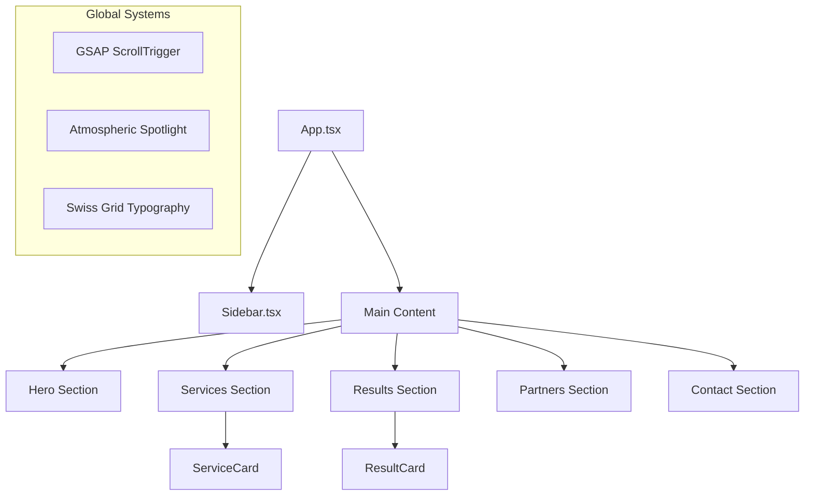

# Vexyn Project Index: Technical Map

This document provides a comprehensive technical index of the Vexyn codebase, serving as a navigator for architecture, components, and implementation patterns.

## 1. Core Architecture Stack

- **Framework**: React 19 (Strict Mode)
- **Build Tool**: Vite 8.x
- **Animation Orchestrator**: GSAP (GreenSock) + ScrollTrigger + ScrollToPlugin
- **3D Engine**: Three.js via @react-three/fiber and @react-three/drei
- **Styling**: Vanilla CSS (Standard) with CSS Modules for component isolation.
- **Type Safety**: TypeScript 6.x

---

## 2. Directory Structure

```text
VEXYN_PROD/
├── .gemini/             # AI Brain & Knowledge Items
├── backstage/           # Internal tools, scripts, and documentation
├── public/              # Static assets (fonts, textures, icons)
├── src/                 # Main Source Code
│   ├── assets/          # Project-specific local assets
│   ├── components/      # React Components
│   │   ├── common/      # Reusable UI Atoms (Buttons, Symbols)
│   │   ├── layout/      # Layout Orchestration (Sidebar, Containers)
│   │   └── sections/    # Principal Site Sections (Hero, Services, Results, etc.)
│   ├── test/            # Global tests and integrity checks
│   ├── App.tsx          # Application Root & Scroll Orchestration
│   ├── main.tsx         # Entry Point
│   └── index.css        # Global Design System (Swiss Grid & Variables)
├── CONTEXT.md           # Project Glossary and Implementation Invariants
├── DESIGN.md            # Brutalismo Chic Design Guidelines
└── PROJECT_INDEX.md     # [THIS FILE] Technical Map
```

---

## 3. Component Hierarchy & Flow

The application follows a linear scroll-driven orchestration managed in `App.tsx`.



---

## 4. Key Implementation Modules

### 4.1 Scroll Orchestration (`App.tsx`)
Uses a centralized `scrollTo` function with GSAP `ScrollToPlugin`. 
- **Invariant**: Body class `is-navigating` is applied during scroll to prevent interaction jitter.
- **Refresh**: Global `ScrollTrigger.refresh()` is called after navigations to ensure pinning accuracy.

### 4.2 Services Section (`src/components/sections/Services`)
Implements a kinetic **Card Stack** vertical conveyor.
- **Core Component**: `ServiceCard.tsx`
- **Logic**: Uses GSAP to manage card entry/exit based on scroll progress.

### 4.3 Results Section (`src/components/sections/Results`)
The social proof engine using the "Fan-out" movement.
- **Core Component**: `ResultCard.tsx` (Deep Module)
- **Data**: Orchestrated via `results.data.ts` and configured in `results.config.ts`.

### 4.4 Global Styles (`src/index.css`)
Defines the **Swiss Grid** (72pt / 12pt / 9.6pt) and the **Brutalismo Chic** color palette.
- **Void**: `#050505`
- **Primary**: `#E5511A`

---

## 5. Testing & Integrity

- **Integrity Check**: `src/test/integrity_check.spec.ts` ensures all critical paths and files exist.
- **Component Tests**: Found alongside components (e.g., `Results.test.tsx`).
- **Framework**: Vitest for unit/integration, Playwright for E2E (configured).

---

## 6. Technical Invariants (CRITICAL)

1.  **0px Radius**: No rounded corners are allowed anywhere in the UI.
2.  **No Fake Tech**: Decorative coordinates or "system" labels are prohibited.
3.  **The Shutter Cut**: Transitions must be instant (`step-end`) or high-precision (`power4.inOut`). No elastic bounces.
4.  **Swiss Ratios**: Typography must strictly follow the defined 6rem / 1rem / 0.8rem hierarchy.

---
*Last Updated: 2026-05-14*
